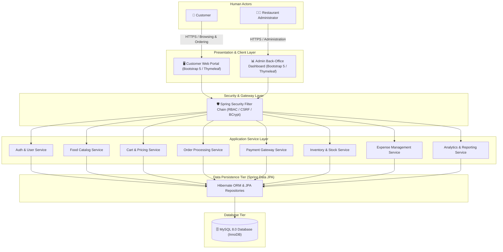
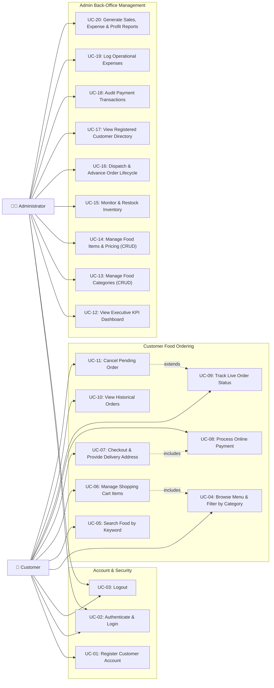
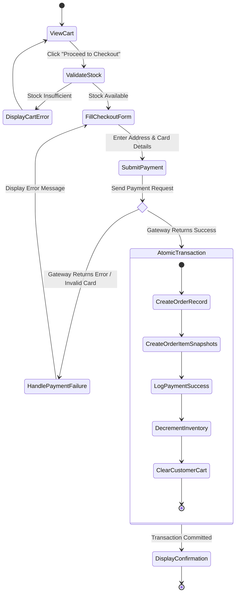
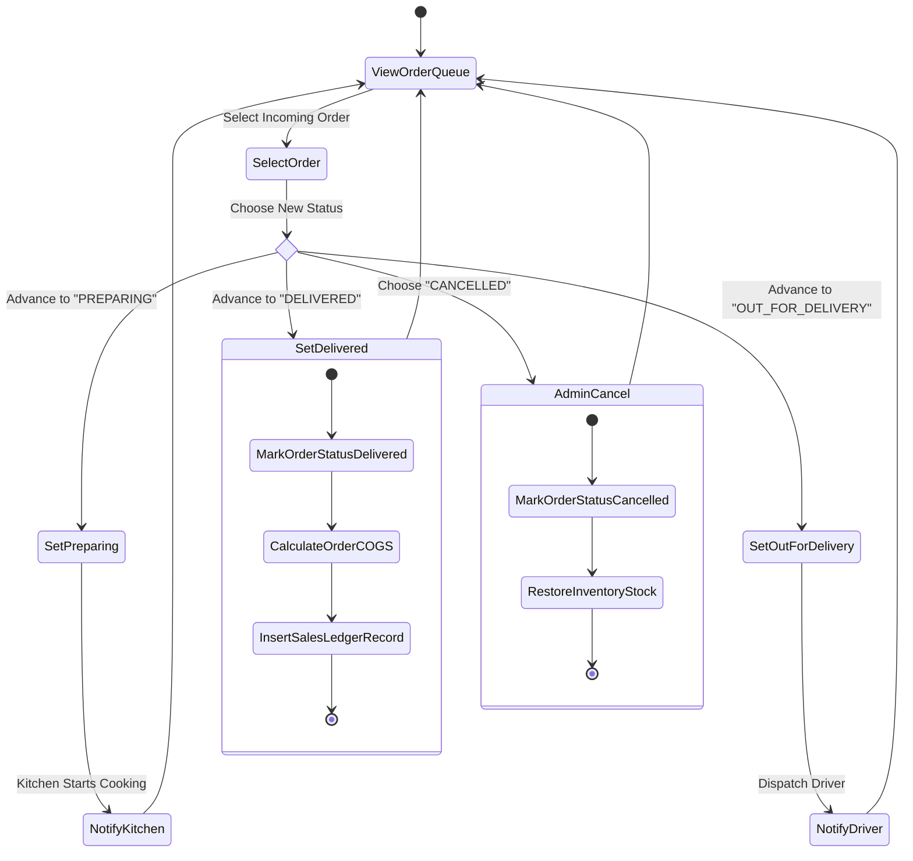
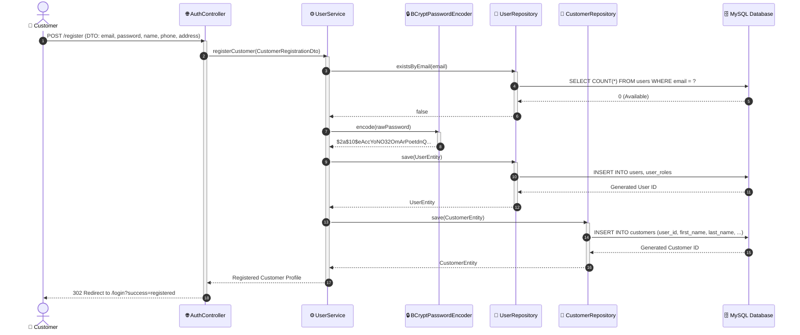
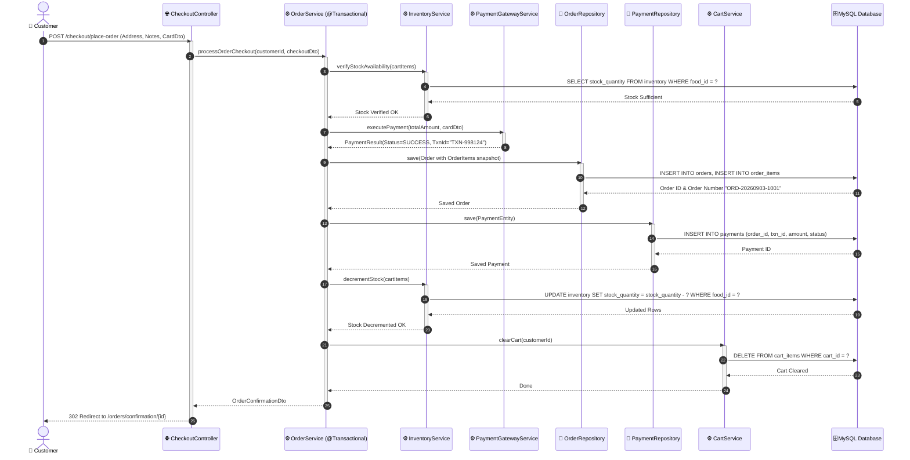
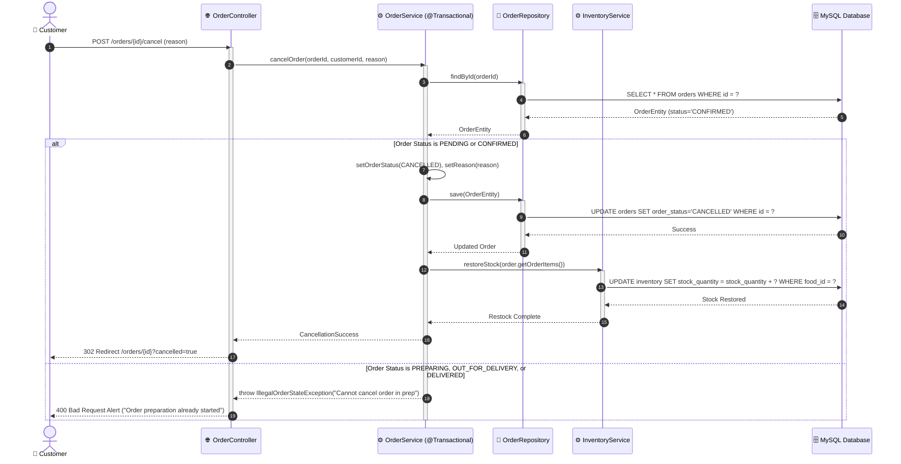
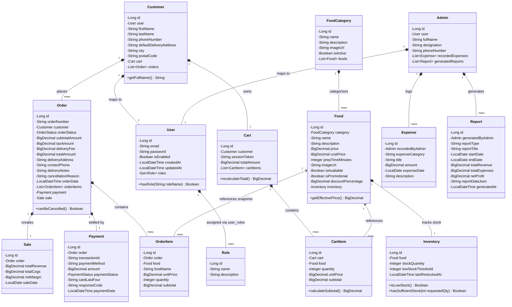
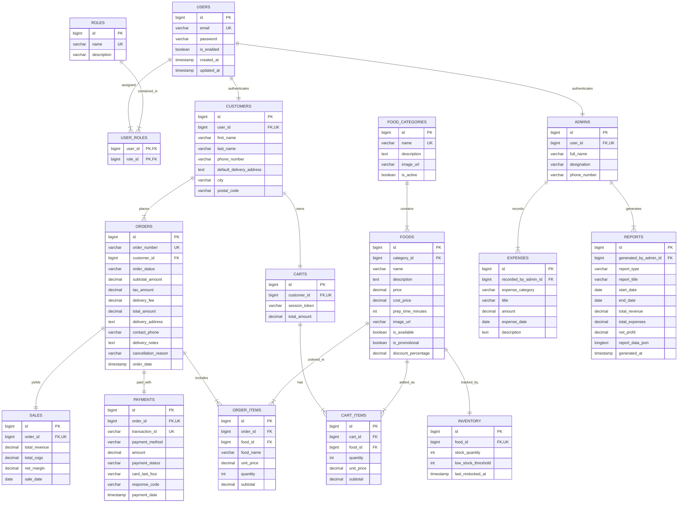

# Unified Modeling Language (UML) Design Specification
## Project Title: Web-based Food Ordering System
**Course:** SE2030 - Software Engineering  
**Modeling Standard:** OMG UML 2.5 Standard (Rendered via Mermaid)

---

## 1. System Overview Diagram

The System Overview Diagram illustrates the high-level subsystem decomposition, depicting how external human actors (**Customer** and **Administrator**) interact with frontend presentations, security gateways, application business modules, and the persistence tier.

---

## 2. Use Case Model

### 2.1 Use Case Diagram

---

### 2.2 Formal Use Case Descriptions

#### Use Case 1: UC-07 & UC-08 (Checkout & Process Online Payment)
- **Primary Actor:** Customer
- **Preconditions:**
  1. Customer is logged in with an active authenticated session.
  2. Customer's shopping cart contains at least one food item.
  3. Requested item quantities do not exceed available inventory stock.
- **Main Success Scenario (Happy Path):**
  1. Customer navigates to `/cart` and clicks **"Proceed to Checkout"**.
  2. System displays the checkout review page with item subtotal, calculated sales tax (5%), delivery fee ($3.50), grand total, and pre-filled delivery address from customer profile.
  3. Customer verifies delivery address, enters optional delivery notes, and inputs card details (Card Number, Expiry, CVV).
  4. Customer clicks **"Confirm & Pay"**.
  5. System validates payment details via simulated gateway service and generates transaction token `TXN-XXXXXXXXXX`.
  6. Within a single transaction (`@Transactional`):
     - Order entity is created in `PENDING` state with a unique `order_number`.
     - Order line items are cloned with snapshot unit prices.
     - Payment record is persisted with status `SUCCESS`.
     - Inventory stock for all ordered foods is decremented.
     - Customer's active cart is cleared.
  7. System redirects customer to the **Order Confirmation & Tracking** page displaying live status `CONFIRMED`.
- **Alternative Flows:**
  - *4a. Insufficient Stock at Checkout:* If stock for any item was claimed by another customer, system aborts checkout, redirects to cart, and alerts customer with the updated available stock.
  - *5a. Payment Gateway Rejection:* If card validation fails (e.g. invalid CVV/expiry), system logs payment as `FAILED`, cancels order creation, does not decrement stock, and displays a descriptive error message on checkout form.
- **Postconditions:**
  - Order is persisted in database with initial status `CONFIRMED`.
  - Payment record is permanently logged.
  - Inventory counts are decremented.
  - Cart is cleared.

---

#### Use Case 2: UC-11 (Cancel Pending Order)
- **Primary Actor:** Customer
- **Preconditions:**
  1. Customer is authenticated and owns the targeted order.
  2. Order's current status is strictly `PENDING` or `CONFIRMED`.
- **Main Success Scenario:**
  1. Customer opens the Order Details page `/orders/{id}`.
  2. Customer clicks **"Cancel Order"** and provides an optional cancellation reason.
  3. System prompts for confirmation via modal dialog. Customer confirms.
  4. System verifies that order status has not advanced to `PREPARING`.
  5. Within a single transaction (`@Transactional`):
     - Order status is updated to `CANCELLED`.
     - Order cancellation timestamp and reason are stored.
     - Each line item's ordered quantity is credited back to the `inventory` table.
  6. System reloads the order page showing badge `CANCELLED` and displays a success alert indicating stock has been restored.
- **Alternative Flows:**
  - *4a. Kitchen Already Began Preparation:* If status changed to `PREPARING`, `OUT_FOR_DELIVERY`, or `DELIVERED`, system rejects cancellation with error message: *"Cancellation is not permitted once food preparation has started. Please contact restaurant support."*
- **Postconditions:**
  - Order status is set to `CANCELLED`.
  - Stock is replenished in the `inventory` table.

---

#### Use Case 3: UC-16 (Dispatch & Advance Order Lifecycle)
- **Primary Actor:** Administrator / Kitchen Dispatcher
- **Preconditions:**
  1. Administrator is authenticated with `ROLE_ADMIN`.
  2. Target order exists in the order management queue.
- **Main Success Scenario:**
  1. Admin opens `/admin/orders` dashboard queue.
  2. Admin selects the active order and chooses the next milestone status from the dropdown:
     - `CONFIRMED` $\rightarrow$ `PREPARING`
     - `PREPARING` $\rightarrow$ `OUT_FOR_DELIVERY`
     - `OUT_FOR_DELIVERY` $\rightarrow$ `DELIVERED`
  3. Admin clicks **"Update Status"**.
  4. System validates the state transition order and updates `order_status` in the database with updated timestamp.
  5. If new status is `DELIVERED`, system creates the associated `sales` ledger entry recording recognized revenue, COGS, and gross margin.
  6. Dashboard updates in real-time.
- **Postconditions:**
  - Order reflects latest operational milestone.
  - On delivery, revenue is recognized in the financial sales ledger.

---

## 3. Activity Diagrams

### 3.1 Customer Checkout & Atomic Payment Activity Diagram

---

### 3.2 Admin Order Fulfillment & Financial Recognition Activity Diagram

---

## 4. Sequence Diagrams

### 4.1 Sequence Diagram: Customer Registration & BCrypt Authentication

---

### 4.2 Sequence Diagram: Checkout, Atomic Payment & Inventory Decrement

---

### 4.3 Sequence Diagram: Order Cancellation & Inventory Stock Restoration

---

## 5. Domain Class Diagram (OOP & Spring Boot Entities)

---

## 6. Visual Entity-Relationship Diagram (Crow's Foot ERD)

---

## 7. Package Diagram (Clean Layered Architecture)

The Package Diagram illustrates the decoupling of layers following Spring Boot enterprise conventions and Clean Architecture.

```mermaid
graph TD
    subgraph com.foodie.app["Root: com.foodie.app"]
        subgraph config["📁 config"]
            SecConfig["SecurityConfig"]
            WebConfig["WebMvcConfig"]
            JPAConfig["JpaAuditingConfig"]
        end

        subgraph controller["📁 controller"]
            AuthCtrl["AuthController"]
            CustCtrl["CustomerController"]
            MenuCtrl["MenuController"]
            CartCtrl["CartController"]
            OrderCtrl["OrderController"]
            AdminCtrl["AdminDashboardController"]
            AdminFoodCtrl["AdminFoodController"]
            AdminOrderCtrl["AdminOrderController"]
            AdminReportCtrl["AdminReportController"]
        end

        subgraph api["📁 controller.api (REST Endpoints)"]
            AuthApi["AuthRestController"]
            FoodApi["FoodRestController"]
            CartApi["CartRestController"]
            OrderApi["OrderRestController"]
            InventoryApi["InventoryRestController"]
            AnalyticsApi["AnalyticsRestController"]
        end

        subgraph dto["📁 dto"]
            AuthDTOs["Auth & Register DTOs"]
            CartDTOs["CartItem & Cart DTOs"]
            CheckoutDTOs["Checkout & Payment DTOs"]
            OrderDTOs["OrderResponse DTOs"]
            AdminDTOs["Expense & Report DTOs"]
        end

        subgraph service["📁 service"]
            subgraph svc_interfaces["service interfaces"]
                IUserSvc["UserService"]
                IFoodSvc["FoodService"]
                ICartSvc["CartService"]
                IOrderSvc["OrderService"]
                IPaymentSvc["PaymentService"]
                IInventorySvc["InventoryService"]
                IExpenseSvc["ExpenseService"]
                IReportSvc["ReportService"]
            end
            subgraph svc_impl["service.impl"]
                UserSvcImpl["UserServiceImpl"]
                FoodSvcImpl["FoodServiceImpl"]
                CartSvcImpl["CartServiceImpl"]
                OrderSvcImpl["OrderServiceImpl"]
                PaymentSvcImpl["PaymentServiceImpl"]
                InventorySvcImpl["InventoryServiceImpl"]
                ExpenseSvcImpl["ExpenseServiceImpl"]
                ReportSvcImpl["ReportServiceImpl"]
            end
        end

        subgraph repository["📁 repository"]
            UserRepo["UserRepository"]
            RoleRepo["RoleRepository"]
            CustRepo["CustomerRepository"]
            AdminRepo["AdminRepository"]
            CategoryRepo["FoodCategoryRepository"]
            FoodRepo["FoodRepository"]
            InventoryRepo["InventoryRepository"]
            CartRepo["CartRepository"]
            CartItemRepo["CartItemRepository"]
            OrderRepo["OrderRepository"]
            OrderItemRepo["OrderItemRepository"]
            PaymentRepo["PaymentRepository"]
            ExpenseRepo["ExpenseRepository"]
            SaleRepo["SaleRepository"]
            ReportRepo["ReportRepository"]
        end

        subgraph entity["📁 entity"]
            UserE["User"]
            RoleE["Role"]
            CustE["Customer"]
            AdminE["Admin"]
            CatE["FoodCategory"]
            FoodE["Food"]
            InvE["Inventory"]
            CartE["Cart"]
            CartItemE["CartItem"]
            OrderE["Order"]
            OrderItemE["OrderItem"]
            PaymentE["Payment"]
            ExpenseE["Expense"]
            SaleE["Sale"]
            ReportE["Report"]
        end

        subgraph exception["📁 exception"]
            GlobalExceptionHandler["GlobalExceptionHandler"]
            ResourceNotFoundEx["ResourceNotFoundException"]
            InsufficientStockEx["InsufficientStockException"]
            InvalidOrderStateEx["InvalidOrderStateException"]
            PaymentFailedEx["PaymentFailedException"]
        end
    end

    %% Dependency flow
    controller --> service
    api --> service
    controller --> dto
    api --> dto
    service --> repository
    service --> dto
    repository --> entity
    config --> service
```

---
