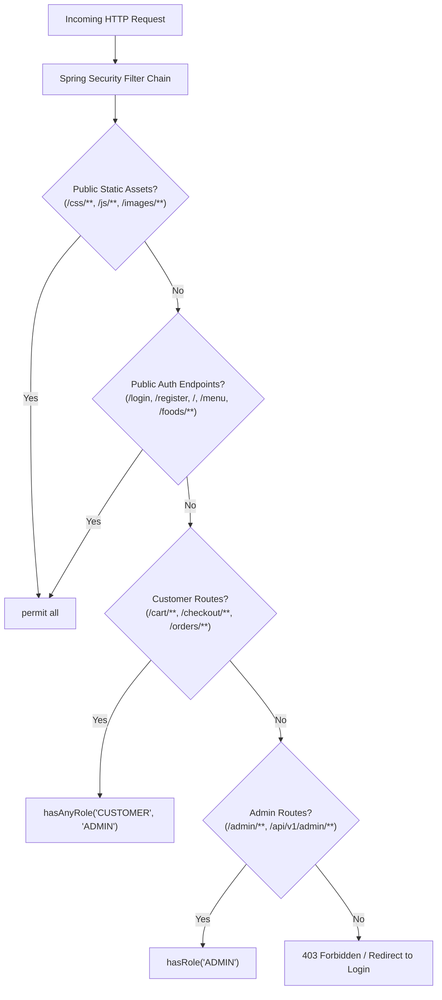

# System Architecture & Technical Design Specification
## Project Title: Web-based Food Ordering System
**Course:** SE2030 - Software Engineering  
**Architecture Style:** Clean Layered Architecture & Multi-Tier MVC / REST  
**Technology Framework:** Spring Boot 3.x (Java 21 LTS) • Spring Security 6 • Spring Data JPA • MySQL 8

---

## 1. Architectural Style & Clean Architecture Principles

The **Web-based Food Ordering System** is architected according to **Clean Architecture** and the **Multi-Tier Model-View-Controller (MVC)** design pattern. The architecture enforces strict separation of concerns, high cohesion, low coupling, and the **Dependency Inversion Principle (DIP)**.

```
┌─────────────────────────────────────────────────────────────────────────┐
│                        1. Presentation Layer                            │
│   • Thymeleaf UI Templates (HTML5, Bootstrap 5.3, JavaScript ES6)       │
│   • MVC Web Controllers (@Controller) & View Models                     │
│   • RESTful API Controllers (@RestController) producing JSON            │
└────────────────────────────────────┬────────────────────────────────────┘
                                     │ DTOs / Command Objects
┌────────────────────────────────────▼────────────────────────────────────┐
│                        2. Security & Gateway Layer                      │
│   • Spring Security Filter Chain (SecurityFilterChain)                  │
│   • Custom UserDetailsService & Role-Based Access Guards (RBAC)         │
│   • BCrypt Password Encryption & CSRF Token Interceptors                │
└────────────────────────────────────┬────────────────────────────────────┘
                                     │ Authenticated Principal / DTOs
┌────────────────────────────────────▼────────────────────────────────────┐
│                        3. Business Service Layer                        │
│   • Service Interfaces & Concrete Implementations (@Service)            │
│   • Declarative ACID Transaction Boundaries (@Transactional)            │
│   • Business Rule Validation & Domain Policy Enforcement                │
└────────────────────────────────────┬────────────────────────────────────┘
                                     │ Domain Entities / Aggregates
┌────────────────────────────────────▼────────────────────────────────────┐
│                        4. Persistence Layer                             │
│   • Spring Data JPA Repositories (JpaRepository Interfaces)             │
│   • Hibernate ORM (Object-Relational Mapping & Entity Lifecycle)         │
│   • Optimized JPQL & Derived Queries                                    │
└────────────────────────────────────┬────────────────────────────────────┘
                                     │ JDBC / Connection Pool (HikariCP)
┌────────────────────────────────────▼────────────────────────────────────┐
│                        5. Database Layer                                │
│   • MySQL 8.0 Community Server (InnoDB Storage Engine)                  │
└─────────────────────────────────────────────────────────────────────────┘
```

---

## 2. Layer Responsibilities & SOLID Principles Implementation

### 2.1 Layer Responsibilities

| Layer | Package Name | Primary Responsibility | Key Classes / Interfaces |
| :--- | :--- | :--- | :--- |
| **Presentation (Web MVC)** | `com.foodie.app.controller` | Accepts HTTP requests, validates form DTOs, binds data to Spring `Model`, returns Thymeleaf view templates. | `AuthController`, `CustomerController`, `MenuController`, `CartController`, `OrderController`, `AdminDashboardController` |
| **Presentation (REST APIs)** | `com.foodie.app.controller.api` | Provides stateless JSON REST endpoints for AJAX operations and external client consumption. | `AuthRestController`, `FoodRestController`, `CartRestController`, `OrderRestController`, `InventoryRestController` |
| **Data Transfer (DTOs)** | `com.foodie.app.dto` | Encapsulates input payloads and response projections, insulating domain entities from presentation exposure. | `CustomerRegistrationDto`, `LoginRequestDto`, `AddToCartDto`, `CheckoutDto`, `OrderResponseDto`, `ExpenseDto` |
| **Business Services** | `com.foodie.app.service` | Encapsulates business logic, orchestrates cross-repository transactions, validates invariants. | `UserService`, `FoodService`, `CartService`, `OrderService`, `PaymentService`, `InventoryService`, `ReportService` |
| **Data Access (Repositories)**| `com.foodie.app.repository` | Defines data access contracts using Spring Data JPA, executing parameterized SQL via Hibernate. | `UserRepository`, `CustomerRepository`, `FoodRepository`, `OrderRepository`, `InventoryRepository`, `PaymentRepository` |
| **Domain Entities** | `com.foodie.app.entity` | JPA Object-Relational entity mappings matching the 16 database tables with lifecycle hooks. | `User`, `Role`, `Customer`, `Admin`, `FoodCategory`, `Food`, `Inventory`, `Cart`, `Order`, `Payment`, `Sale` |
| **Cross-Cutting Config** | `com.foodie.app.config` | Spring application configuration, security filter chains, custom auth handlers, JPA auditing. | `SecurityConfig`, `WebMvcConfig`, `CustomAuthenticationSuccessHandler` |
| **Exception Handling** | `com.foodie.app.exception` | Intercepts application exceptions and maps them to standardized error pages or RFC-7807 JSON errors. | `GlobalExceptionHandler`, `ResourceNotFoundException`, `InsufficientStockException`, `InvalidOrderStateException` |

### 2.2 Application of SOLID Principles

1. **Single Responsibility Principle (SRP):**
   - Each service class has a single distinct reason to change (e.g., `PaymentService` exclusively handles payment gateway interactions; `InventoryService` strictly manages stock decrement/restock logic).
2. **Open/Closed Principle (OCP):**
   - Service layers are defined as interfaces (e.g., `PaymentService`), allowing mock implementations or real gateway adapters (e.g., Stripe/PayPal) to be substituted without modifying client controller code.
3. **Liskov Substitution Principle (LSP):**
   - Repository interfaces extend `JpaRepository<T, ID>` and can seamlessly be replaced with customized derived implementations without breaking calling service layers.
4. **Interface Segregation Principle (ISP):**
   - Fine-grained service interfaces ensure controllers only depend on methods relevant to their context (e.g., `CartController` depends only on `CartService`, not on administrative reporting services).
5. **Dependency Inversion Principle (DIP):**
   - Controllers and services depend exclusively on high-level abstractions (interfaces), with dependencies injected by Spring's Inversion of Control (IoC) container via constructor injection (`@Autowired` / Lombok `@RequiredArgsConstructor`).

---

## 3. REST API Design & Contract Specification

The system exposes a comprehensive, RESTful API layer conforming to OpenAPI/Swagger standards. All API endpoints reside under the `/api/v1` namespace.

### 3.1 Authentication & Profile APIs (`/api/v1/auth`)

| Endpoint | Method | Access Level | Request Body (DTO) | Response (HTTP & DTO) | Description |
| :--- | :--- | :--- | :--- | :--- | :--- |
| `/api/v1/auth/register` | `POST` | Public | `CustomerRegistrationDto` | `201 Created` / `ApiResponse<CustomerDto>` | Registers a new customer and hashes password. |
| `/api/v1/auth/login` | `POST` | Public | `LoginRequestDto` | `200 OK` / `ApiResponse<UserSessionDto>` | Authenticates credentials and starts session. |
| `/api/v1/auth/logout` | `POST` | Authenticated | None | `200 OK` / `ApiResponse<String>` | Invalidates active user session. |
| `/api/v1/auth/me` | `GET` | Authenticated | None | `200 OK` / `ApiResponse<UserProfileDto>` | Returns authenticated user's profile details. |

### 3.2 Food Catalog & Category APIs (`/api/v1/foods`, `/api/v1/categories`)

| Endpoint | Method | Access Level | Query / Body Params | Response | Description |
| :--- | :--- | :--- | :--- | :--- | :--- |
| `/api/v1/categories` | `GET` | Public | None | `200 OK` / `List<CategoryDto>` | Retrieves all active food categories. |
| `/api/v1/foods` | `GET` | Public | `?categoryId=&keyword=&promotional=` | `200 OK` / `Page<FoodDto>` | Searches and filters food items. |
| `/api/v1/foods/{id}` | `GET` | Public | Path: `id` | `200 OK` / `FoodDetailDto` | Retrieves single food item with stock status. |
| `/api/v1/admin/foods` | `POST` | `ROLE_ADMIN` | `CreateFoodDto` | `201 Created` / `FoodDto` | Adds a new food dish to the catalog. |
| `/api/v1/admin/foods/{id}` | `PUT` | `ROLE_ADMIN` | Path: `id`, `UpdateFoodDto` | `200 OK` / `FoodDto` | Updates price, description, or availability. |
| `/api/v1/admin/foods/{id}` | `DELETE` | `ROLE_ADMIN` | Path: `id` | `204 No Content` | Deactivates or removes a food item. |

### 3.3 Shopping Cart APIs (`/api/v1/cart`)

| Endpoint | Method | Access Level | Request Body (DTO) | Response | Description |
| :--- | :--- | :--- | :--- | :--- | :--- |
| `/api/v1/cart` | `GET` | `ROLE_CUSTOMER` | None | `200 OK` / `CartDto` | Retrieves active customer cart with totals. |
| `/api/v1/cart/items` | `POST` | `ROLE_CUSTOMER` | `AddToCartDto` | `200 OK` / `CartDto` | Adds food item to cart with requested qty. |
| `/api/v1/cart/items/{itemId}` | `PUT` | `ROLE_CUSTOMER` | `UpdateCartItemDto` | `200 OK` / `CartDto` | Updates line-item quantity in cart. |
| `/api/v1/cart/items/{itemId}` | `DELETE` | `ROLE_CUSTOMER` | Path: `itemId` | `200 OK` / `CartDto` | Removes item from cart. |
| `/api/v1/cart` | `DELETE` | `ROLE_CUSTOMER` | None | `204 No Content` | Clears all items from cart. |

### 3.4 Order & Checkout APIs (`/api/v1/orders`)

| Endpoint | Method | Access Level | Request Body (DTO) | Response | Description |
| :--- | :--- | :--- | :--- | :--- | :--- |
| `/api/v1/orders/checkout` | `POST` | `ROLE_CUSTOMER` | `CheckoutDto` | `201 Created` / `OrderResponseDto` | Executes atomic checkout and simulated payment. |
| `/api/v1/orders` | `GET` | `ROLE_CUSTOMER` | `?page=0&size=10` | `200 OK` / `Page<OrderSummaryDto>` | Retrieves logged-in customer's order history. |
| `/api/v1/orders/{id}` | `GET` | `ROLE_CUSTOMER` / `ROLE_ADMIN` | Path: `id` | `200 OK` / `OrderDetailDto` | Retrieves detailed itemized order breakdown. |
| `/api/v1/orders/{id}/cancel` | `POST` | `ROLE_CUSTOMER` | `CancelOrderDto` | `200 OK` / `OrderResponseDto` | Cancels pending order and restocks inventory. |
| `/api/v1/admin/orders` | `GET` | `ROLE_ADMIN` | `?status=&page=0&size=20` | `200 OK` / `Page<AdminOrderDto>` | Admin order queue with status filtering. |
| `/api/v1/admin/orders/{id}/status`| `PATCH` | `ROLE_ADMIN` | `UpdateStatusDto` | `200 OK` / `AdminOrderDto` | Advances order milestone status. |

### 3.5 Inventory & Financial Report APIs (`/api/v1/admin`)

| Endpoint | Method | Access Level | Request Body / Params | Response | Description |
| :--- | :--- | :--- | :--- | :--- | :--- |
| `/api/v1/admin/inventory` | `GET` | `ROLE_ADMIN` | `?lowStockOnly=true` | `200 OK` / `List<InventoryDto>` | Fetches stock quantities and alerts. |
| `/api/v1/admin/inventory/{id}/restock` | `POST` | `ROLE_ADMIN` | `RestockDto` | `200 OK` / `InventoryDto` | Replenishes stock quantity. |
| `/api/v1/admin/expenses` | `POST` | `ROLE_ADMIN` | `CreateExpenseDto` | `201 Created` / `ExpenseDto` | Logs a new operational expense voucher. |
| `/api/v1/admin/expenses` | `GET` | `ROLE_ADMIN` | `?startDate=&endDate=` | `200 OK` / `List<ExpenseDto>` | Retrieves expense records within date range. |
| `/api/v1/admin/reports/sales` | `GET` | `ROLE_ADMIN` | `?startDate=&endDate=` | `200 OK` / `SalesReportDto` | Computes revenue and items sold in period. |
| `/api/v1/admin/reports/profit` | `GET` | `ROLE_ADMIN` | `?startDate=&endDate=` | `200 OK` / `ProfitReportDto` | Computes Net Profit = Revenue - (COGS + Expenses). |

---

## 4. Security Architecture & Spring Security 6 Configuration

### 4.1 Security Filter Chain & Route Authorization Matrix



### 4.2 Security Standards & Implementation Details
1. **Password Encoding:** Utilizes `BCryptPasswordEncoder` configured with work factor (strength) **10**, generating collision-resistant 60-character salted cryptographic hashes.
2. **CSRF Protection:** CSRF token verification is enabled by default for all state-changing HTTP requests (`POST`, `PUT`, `PATCH`, `DELETE`). Thymeleaf automatically injects `_csrf` hidden input tokens into all server-rendered forms.
3. **Role-Based Redirection:** A custom `AuthenticationSuccessHandler` examines the authenticated user's authorities:
   - Users with `ROLE_ADMIN` are automatically directed to `/admin/dashboard`.
   - Users with `ROLE_CUSTOMER` are automatically directed to `/menu`.
4. **Session Management:** Configured with `sessionCreationPolicy(SessionCreationPolicy.IF_REQUIRED)`, enforcing maximum of 1 concurrent session per user with session fixation protection (`migrateSession()`).

---

## 5. Transaction Management & ACID Boundary Design

The system implements declarative transaction management via Spring's `@Transactional` annotation:

### 5.1 Order Checkout Transactional Boundary
```java
@Transactional(rollbackFor = Exception.class, isolation = Isolation.READ_COMMITTED)
public OrderResponseDto processOrderCheckout(Long customerId, CheckoutDto checkoutDto) {
    // 1. Pessimistic read / stock check across all cart items
    // 2. Invoke PaymentGatewayService (simulated card processing)
    // 3. Persist Order entity and snapshot OrderItem entities
    // 4. Atomically decrement stock in Inventory entity
    // 5. Persist Payment audit record with status SUCCESS
    // 6. Clear customer's CartItems
    // Any unhandled RuntimeException or Checked Exception triggers an atomic ROLLBACK.
}
```

### 5.2 Order Cancellation Transactional Boundary
```java
@Transactional(rollbackFor = Exception.class)
public OrderResponseDto cancelOrder(Long orderId, Long customerId, String reason) {
    // 1. Verify Order ownership and state: must be PENDING or CONFIRMED
    // 2. Set Order status = CANCELLED and store reason
    // 3. Restore ordered quantities back into the Inventory table
    // 4. Save updated entities atomically
}
```

---

## 6. Exception Handling Architecture

The application adopts a dual-tier exception handling architecture supporting both server-rendered HTML views and RESTful JSON APIs.

### 6.1 Custom Business Exception Hierarchy
- `FoodOrderingException` (Base runtime exception)
  - `ResourceNotFoundException` (HTTP 404: Food, Category, Order, User not found)
  - `InsufficientStockException` (HTTP 400 / 409: Requested quantity > stock in inventory)
  - `InvalidOrderStateException` (HTTP 400: Customer attempts cancellation on `PREPARING` order)
  - `PaymentFailedException` (HTTP 402: Card declined or invalid payment parameters)
  - `DuplicateResourceException` (HTTP 409: Email already registered)
  - `UnauthorizedAccessException` (HTTP 403: Customer attempting to inspect another user's order)

### 6.2 Global Exception Handlers
1. **`GlobalWebExceptionHandler` (`@ControllerAdvice`):**
   - Intercepts exceptions originating from standard MVC controllers.
   - Binds error messages to redirect attributes or renders a styled `error/custom-error.html` page with appropriate user guidance.
2. **`GlobalRestExceptionHandler` (`@RestControllerAdvice`):**
   - Intercepts exceptions originating from `@RestController` API endpoints.
   - Formats responses using standardized **RFC-7807 Problem Details** JSON:
     ```json
     {
       "timestamp": "2026-09-03T20:25:00",
       "status": 409,
       "error": "Conflict",
       "message": "Insufficient stock for item: Buffalo Glazed Chicken Wings. Available: 4, Requested: 8",
       "path": "/api/v1/orders/checkout"
     }
     ```

---
